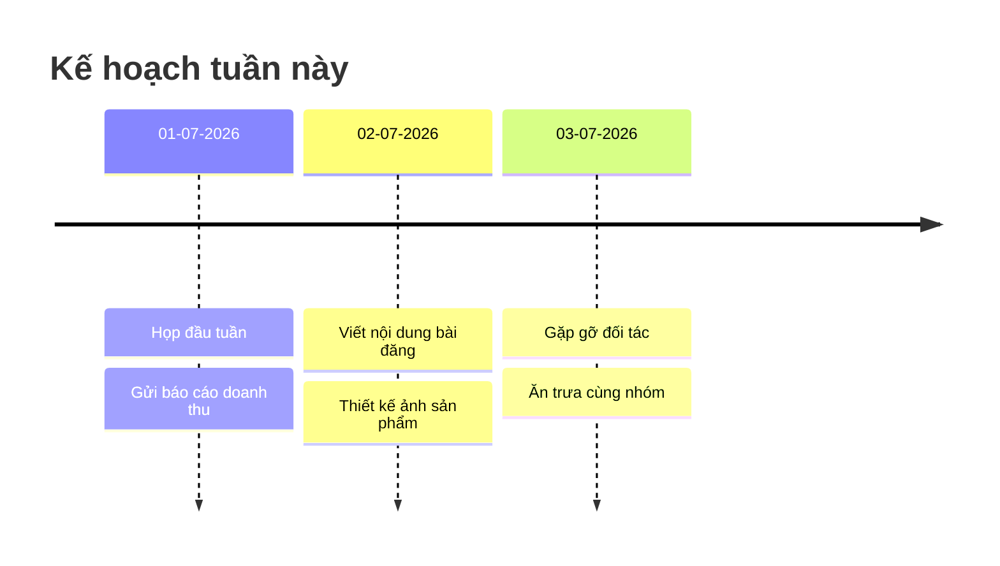

Có chứ. Dưới đây là **lộ trình 30 ngày — mỗi ngày một project Spring Boot**, đi từ CRUD cơ bản đến security, caching, messaging và microservices. Mỗi project nên dành khoảng **1–3 giờ**, tập trung làm một phiên bản chạy được thay vì cố hoàn thiện mọi tính năng.
## Tuần 1 — Nền tảng Spring Boot và REST API

| Ngày | Project               | Nội dung chính                            |
| ---- | --------------------- | ----------------------------------------- |
| 1    | Hello Spring Boot API | Controller, endpoint, cấu trúc project    |
| 2    | Todo List API         | CRUD, DTO, validation                     |
| 3    | Student Management    | Spring Data JPA, MySQL/PostgreSQL         |
| 4    | Product Catalog       | Search, filter, pagination, sorting       |
| 5    | Library Management    | Quan hệ `OneToMany`, `ManyToOne`          |
| 6    | Expense Tracker       | Thống kê theo ngày, tháng, category       |
| 7    | Notes API             | Global exception handling, response chuẩn |
**Mục tiêu tuần:** tự xây được REST API có database, validation và xử lý lỗi.
## Tuần 2 — Authentication và nghiệp vụ thực tế

| Ngày | Project            | Nội dung chính                          |
| ---- | ------------------ | --------------------------------------- |
| 8    | User Registration  | Mã hóa password bằng BCrypt             |
| 9    | JWT Authentication | Login, access token, protected endpoint |
| 10   | Role-Based Access  | Phân quyền `USER`, `ADMIN`              |
| 11   | Blog API           | User, post, comment, authorization      |
| 12   | Shopping Cart      | Cart, cart item, tính tổng tiền         |
| 13   | Order Management   | Trạng thái đơn hàng, transaction        |
| 14   | Booking System     | Kiểm tra lịch trùng, đặt và hủy lịch    |
**Mục tiêu tuần:** hiểu Spring Security, JWT và cách tổ chức business logic.
## Tuần 3 — Tích hợp và nâng cao

|Ngày|Project|Nội dung chính|
|---|---|---|
|15|File Upload Service|Upload/download file, giới hạn định dạng|
|16|Email Service|Gửi email xác nhận hoặc reset password|
|17|Weather Client|Gọi external API bằng `WebClient`|
|18|URL Shortener|Sinh short code, redirect, thống kê click|
|19|Redis Cache Demo|Cache dữ liệu, TTL, cache invalidation|
|20|Scheduled Job|`@Scheduled`, xử lý tác vụ định kỳ|
|21|Audit Log System|Ghi lại người tạo, người sửa, thời gian|
**Mục tiêu tuần:** biết kết nối Spring Boot với dịch vụ bên ngoài và xử lý tác vụ nền.
## Tuần 4 — Production và microservices

| Ngày | Project            | Nội dung chính                                |
| ---- | ------------------ | --------------------------------------------- |
| 22   | Dockerized API     | Dockerfile, Docker Compose, database          |
| 23   | API Documentation  | Swagger/OpenAPI                               |
| 24   | Testing Project    | JUnit, Mockito, integration test              |
| 25   | Rate Limiter       | Giới hạn request theo IP hoặc user            |
| 26   | Kafka Order Events | Producer, consumer, event-driven              |
| 27   | Service Discovery  | Eureka Server và hai services                 |
| 28   | API Gateway        | Routing, authentication filter                |
| 29   | Resilience Demo    | Retry, circuit breaker với Resilience4j       |
| 30   | Mini E-commerce    | Tổng hợp authentication, product, cart, order |
**Mục tiêu tuần:** đóng gói, test và thiết kế ứng dụng gần với môi trường thực tế.
## Cách thực hiện mỗi ngày
Mỗi project nên đi theo quy trình:
1. Viết README ngắn: bài toán, entity và API cần làm.
2. Tạo project bằng Spring Initializr.
3. Thiết kế entity và database.
4. Viết repository, service, controller.
5. Thêm validation và exception handling.
6. Test API bằng Postman hoặc Bruno.
7. Viết ít nhất 2–3 test case.
8. Push lên GitHub cùng hướng dẫn chạy.
Cấu trúc package nên thống nhất:
```
src/main/java/com/example/project
├── config
├── controller
├── dto
├── entity
├── exception
├── mapper
├── repository
├── security
└── service
```
## Tiêu chuẩn hoàn thành một project
Một project được xem là hoàn thành khi:
- Chạy được trên máy.
- API trả đúng status code.
- Dữ liệu được lưu trong database.
- Có validation và xử lý exception.
- Có file README hướng dẫn chạy.
- Có Postman collection hoặc Swagger.
- Có ít nhất một vài test quan trọng.
Đừng cố dùng microservices ngay từ đầu. Trong 2 tuần đầu, hãy ưu tiên viết **monolith sạch, phân tầng rõ ràng và nghiệp vụ đúng**. Sau 30 ngày, bạn có thể chọn project e-commerce hoặc booking để phát triển thành portfolio chính.

```chronos
- [17/7/2026~] {Group A} baz
- [2021~2022] #green {Group A}  foo
- [2020~2022] #green {Group B} bar
- [2022~2025] {Group B} bam
```

```chronos
> NOSTACK
- [2019~2021] {Group A} baz
- [2021~2022] #green {Group A}  foo
- [2020~2022] #green {Group B} bar
- [2022~2025] {Group B} bam
```




```mermaid
timeline
    title Lịch trình sự kiện ngày 17/07
    08:00 : Khai mạc sự kiện : Đón tiếp đại biểu
    10:30 : Hội thảo chuyên đề 1 : Thảo luận bàn tròn
    12:00 : Nghỉ trưa : Tiệc buffet tại sảnh
    14:00 : Hội thảo chuyên đề 2 : Ra mắt sản phẩm mới
```


```chronos
- [08:30] Check-in đại biểu // Phát tài liệu và thẻ đeo tại quầy lễ tân
- [09:00] Phát biểu khai mạc // Giám đốc điều hành tuyên bố lý do sự kiện
- [10:15] Tiệc trà giữa giờ // Giao lưu tự do và thưởng thức teabreak
- [11:00] Tọa đàm chuyên sâu // Thảo luận về xu hướng công nghệ năm 2026
```

```chronos
- [2026-07-17 08:00] Bắt đầu ngày hội công nghệ
- [2026-07-17 14:00] Buổi workshop chuyên sâu
- [2026-07-18 09:00] Bế mạc và trao giải thưởng
```

```md
- [ ] #task 08:00 - 10:00 This task uses the shorthand format ⏳ 2021-08-29
- [ ] #task 11:00 - 13:00 This task uses the Dataview property format [scheduled:: 2021-08-29]
```

```weave
model: Hệ Thống Bán Hàng
domain khách_hàng:
    id: text
    tên: text
    ví_tiền: number
domain đơn_hàng:
    id: text
    tổng_tiền: number
```

